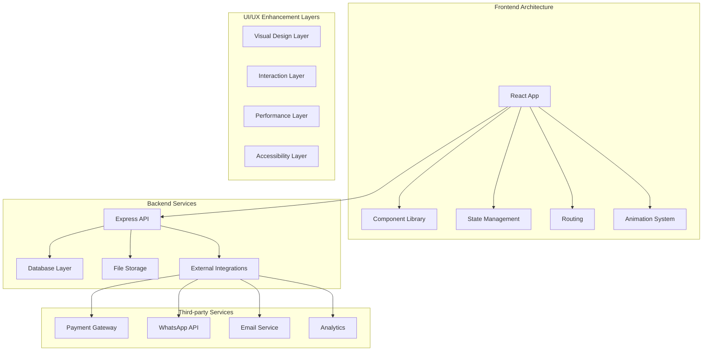
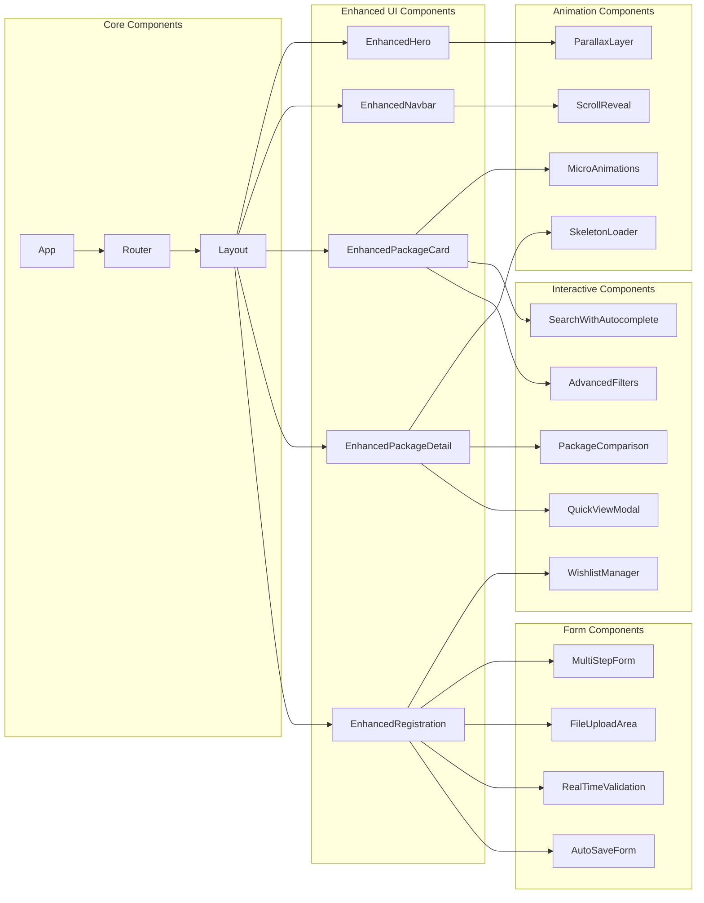
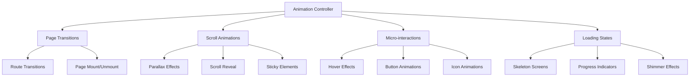
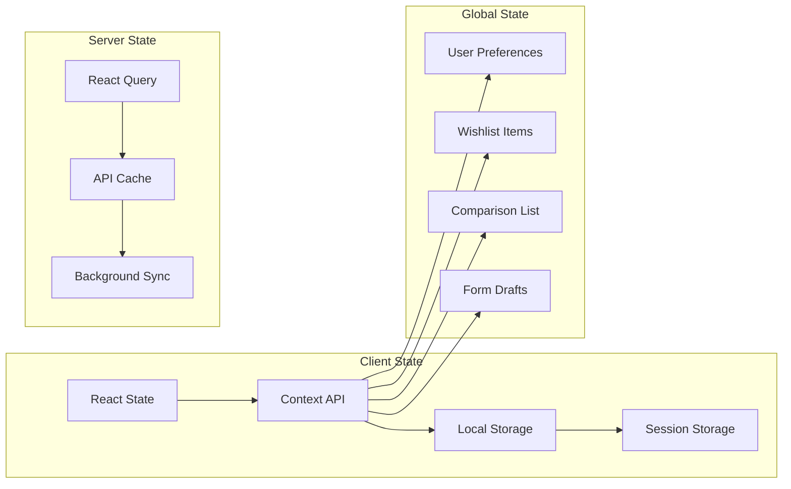
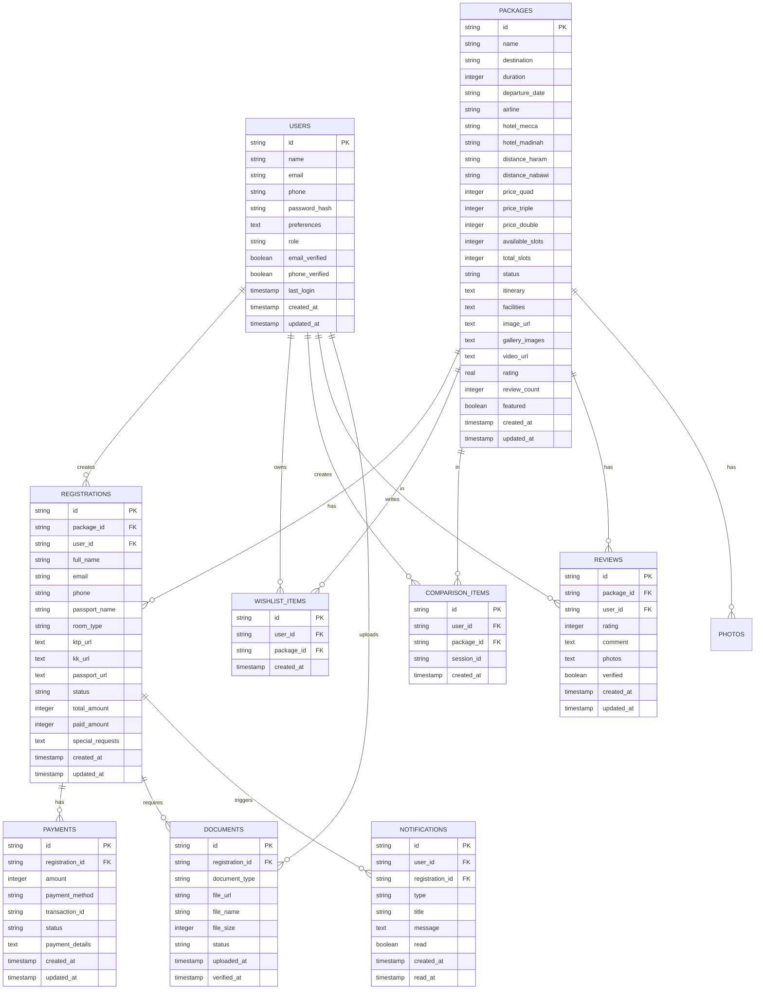
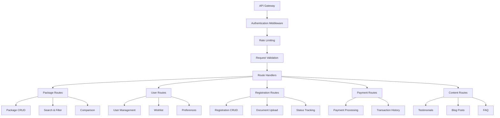
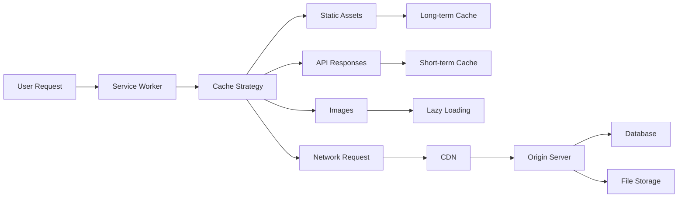
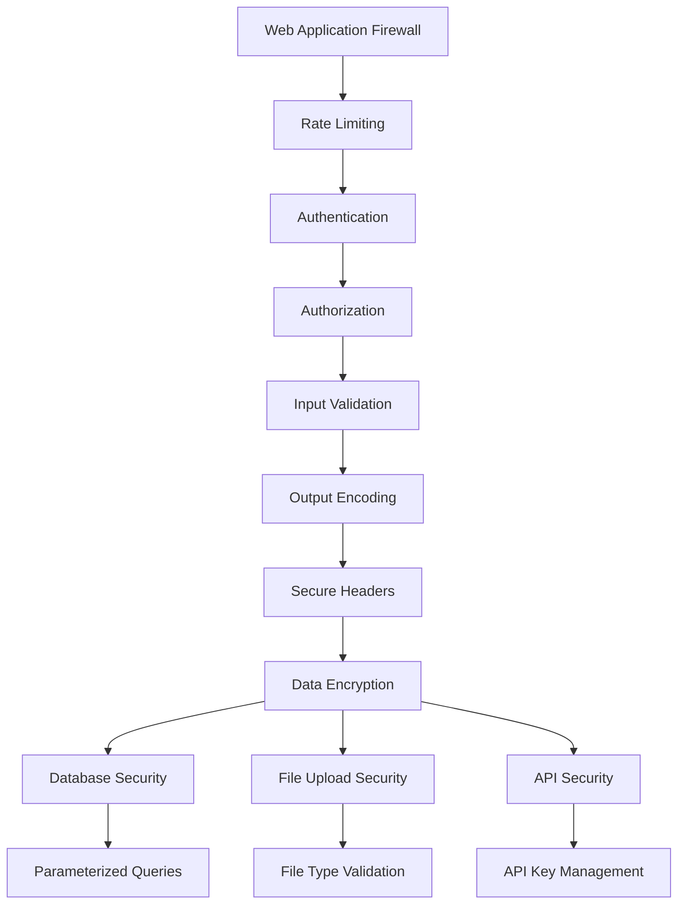
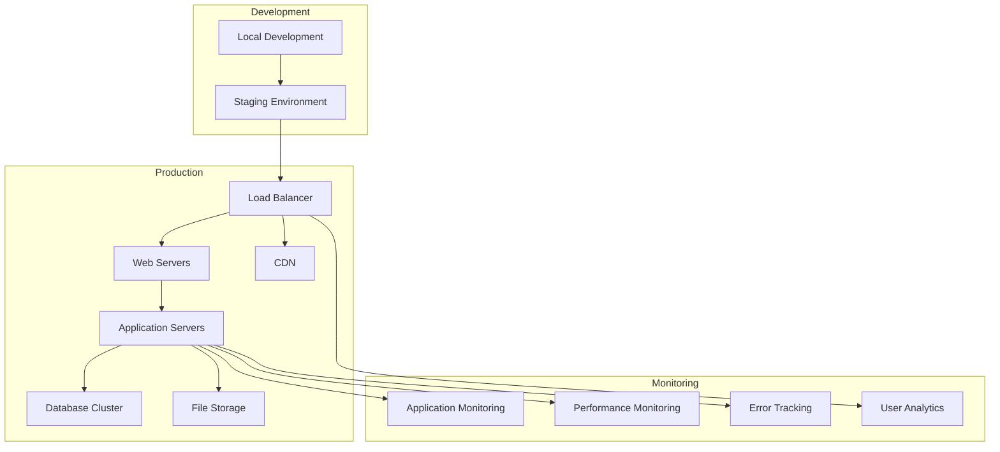
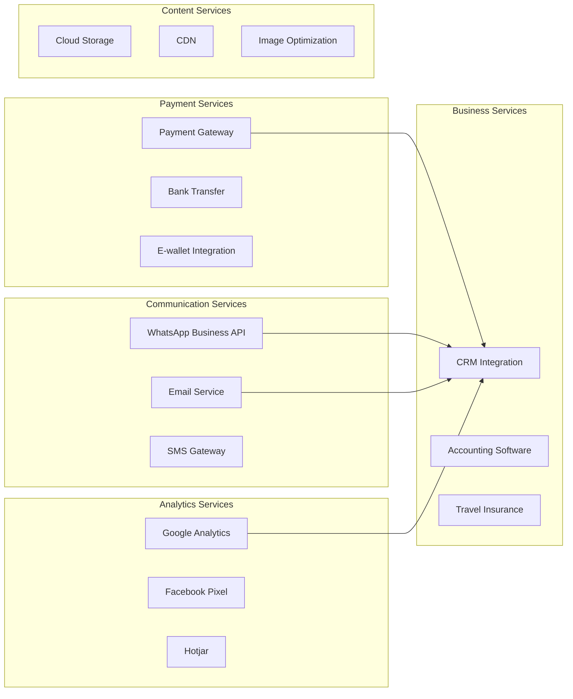

# MuhajirinTravel Technical Architecture

## System Overview

## Component Architecture

### Enhanced Component Structure

## Animation System Architecture

### Animation Hierarchy

## State Management Architecture

### Data Flow Structure

## Database Schema Enhancement

### Extended Data Models

## API Architecture

### Endpoint Structure

## Performance Optimization Strategy

### Loading and Caching Strategy

## Security Architecture

### Security Layers

## Deployment Architecture

### Infrastructure Setup

## Integration Architecture

### Third-party Service Integration

## Technology Stack Summary

### Frontend Technologies
- **Framework**: React 18 with TypeScript
- **Routing**: Wouter (lightweight routing)
- **State Management**: React Query + Context API
- **UI Library**: Radix UI + Tailwind CSS
- **Animations**: Framer Motion
- **Forms**: React Hook Form + Zod Validation
- **Icons**: Lucide React + React Icons

### Backend Technologies
- **Runtime**: Node.js with Express
- **Database**: PostgreSQL with Drizzle ORM
- **Authentication**: Passport.js
- **File Storage**: Cloud-based storage
- **Session Management**: Express Session with Memory Store

### Development Tools
- **Build Tool**: Vite
- **Package Manager**: npm
- **Code Quality**: ESLint + TypeScript
- **Testing**: Jest + React Testing Library
- **Deployment**: Netlify Functions + Vercel

This architecture provides a solid foundation for implementing all the requested enhancements while maintaining scalability, performance, and security.